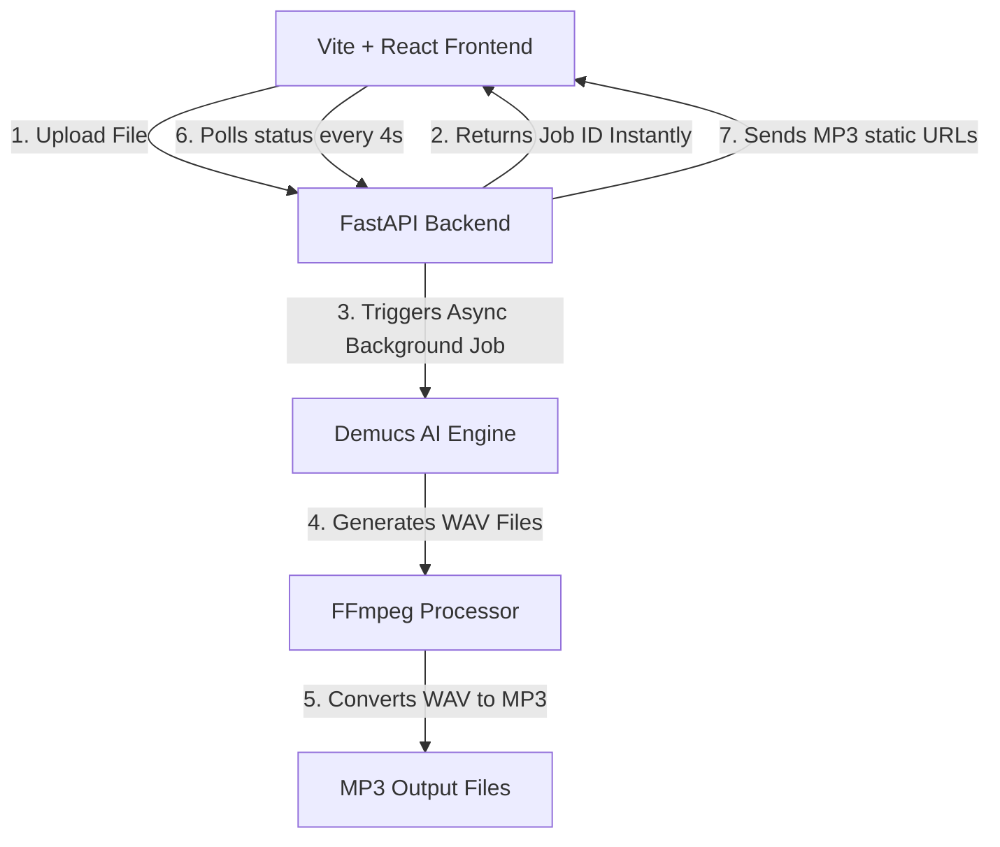

# AI Music Splitter — System Documentation

This document explains exactly how the **AI Music Splitter** works, its architecture, specs, deployment on Hugging Face Spaces, and the performance optimizations that resolve timeouts and slow processing.

---

## 1. System Architecture Overview

The application is built using a modern decoupled architecture:



### Frontend (Client-side)
* **Stack**: Vite + React + TypeScript + Tailwind CSS / Shadcn UI.
* **Service Layer (`audio-splice-studio/src/services/api.ts`)**:
  - Uploads the audio file to the `/split` endpoint.
  - Receives a `jobId` immediately and starts a polling loop (`GET /jobs/{jobId}`) every 4 seconds.
  - Controls the user interface states: `Upload` -> `Processing` (with live status logs & stopwatch) -> `Results`.

### Backend (Server-side)
* **Stack**: FastAPI + Uvicorn + Python 3.11 + PyTorch.
* **Job System**: Keeps track of running jobs in memory (`JOB_STATUS` dictionary). It runs the separation task asynchronously in a background thread to release the HTTP connection immediately.
* **Audio Conversion**: Uses `ffmpeg` to compress the heavy `.wav` files into `.mp3` format for fast downloading and smooth seeking in the browser player.

---

## 2. Demucs Model & Specs (`htdemucs`)

The core AI processing is handled by **Meta's Demucs (v4.0.1)**.

### Model Details
* **Model Name**: `htdemucs` (Hybrid Transformer Demucs).
* **Model Size**: ~80.2 MB (downloaded from Facebook Research CDN).
* **AI Architecture**: Combines a Convolutional Neural Network (CNN) encoder/decoder with a Transformer layer in the middle to analyze audio spectrograms and separate stems.
* **Separation Modes**: We run it with `--two-stems=vocals` which divides the track into two stems:
  1. `vocals.wav` (vocal track)
  2. `no_vocals.wav` (instrumental / karaoke track)

### Resource Consumption
* **RAM Requirement**: Requires **2 GB to 4 GB of RAM** during the splitting phase.
* **Storage Requirement**: Around **200 MB** for Python dependencies + model checkpoints.
* **Processing Pattern**: Highly CPU/GPU intensive. It splits audio by dividing it into chunks and passing it through PyTorch neural network layers.

---

## 3. Local Setup vs. Hugging Face Spaces Deployment

### A. How it Works Locally
To run the project on your local machine:
1. **Backend**:
   - Create a virtual environment and run: `pip install -r backend/requirements.txt`
   - Run the API: `uvicorn main:app --reload` (runs on `http://localhost:8000`)
2. **Frontend**:
   - Navigate to `audio-splice-studio` and run: `npm install` followed by `npm run dev`
   - During development, Vite proxies requests to the FastAPI server running on port 8000.
3. **Why Local is extremely fast (< 1 minute)**:
   - Your local computer has a high-performance multi-core CPU (e.g., Core i7/i9, Ryzen 5/7/9) and potentially a dedicated GPU.
   - PyTorch automatically utilizes GPU acceleration (CUDA) if available, which cuts processing down to **15-30 seconds**.
   - No thread or resource limits; CPU runs at full boost speed.

---

### B. Hugging Face Spaces Deployment (Free Tier)
* **Platform**: Hugging Face Spaces (deployed using a custom `Dockerfile` containing Node and Python environments).
* **Free Tier Hardware Specs**: 
  - **CPU**: Shared 2-vCPU environment.
  - **RAM**: 16 GB.
  - **GPU**: None (Runs purely on CPU).
* **The Strict Timeout Rule**:
  - Hugging Face runs behind an Nginx reverse proxy.
  - If a single HTTP request takes **more than 60 seconds**, the proxy terminates the connection automatically (throwing a `504 Gateway Timeout` or API error).

---

## 4. Why processing takes 4-5 minutes on Hugging Face (and how we fixed it)

When deploying a heavy machine learning model on a free CPU tier, several issues arise:

### 1. The Gateway Timeout Error (Fixed)
* **The Problem**: A standard audio split takes 3-6 minutes on a slow CPU. If the frontend kept a single `/split` request open, Hugging Face would kill it after 60 seconds.
* **The Fix**: We implemented an **Async Job Queue**. The `/split` endpoint saves the file and returns a `jobId` instantly. The frontend then polls a lightweight `/jobs/{jobId}` endpoint every 4 seconds. Because each request completes in milliseconds, the connection never times out.

### 2. CPU Thrashing (Fixed)
* **The Problem**: By default, PyTorch and Demucs try to spawn as many threads as there are CPU cores. In shared virtualization environments (like Hugging Face containers), this causes **CPU thrashing** (threads constantly context-switching and blocking each other). This makes processing take up to 16+ minutes or crash the space.
* **The Fix**: We added environment variables to restrict PyTorch and OpenMP to exactly **1 CPU thread**, and added the `-j 1` argument to the Demucs CLI command:
  ```python
  os.environ["OMP_NUM_THREADS"] = "1"
  os.environ["MKL_NUM_THREADS"] = "1"
  os.environ["OPENBLAS_NUM_THREADS"] = "1"
  ```
  This keeps CPU usage stable and predictable, allowing a song to split in **3 to 5 minutes** instead of failing or taking 15+ minutes.

### 3. Model Download at Startup (Fixed)
* **The Problem**: Downloading the 80MB model weight file during the first split request added 30-40 seconds to the processing time.
* **The Fix**: We added a step in our `Dockerfile` that runs a dummy separation on a tiny silent tone during the Docker build stage:
  ```dockerfile
  RUN python -m demucs.separate -n htdemucs --two-stems=vocals /app/backend/test_tone.wav -o /tmp/dummy_out && rm -rf /tmp/dummy_out
  ```
  This caches the model inside `/app/.cache/hub/checkpoints/` directly into the Docker image, so it never has to download when a user uploads a song.

### 4. Slow Downloads & Playback Seeking (Fixed)
* **The Problem**: Demucs outputs high-quality `.wav` files. For a 4-minute song, the outputs are around 80MB–100MB. Downloading these took very long, and HTML5 players cannot seek through large unstreamed WAV files.
* **The Fix**: We integrated `ffmpeg` in the backend. Immediately after separation, the backend converts `vocals.wav` and `no_vocals.wav` into `vocals.mp3` and `no_vocals.mp3` (192 kbps bitrate).
  - File size drops from **80MB to ~5MB**.
  - Downloads are instant.
  - The music player progress bar can be clicked to seek to any part of the song instantly.

---

## 5. Hugging Face Deployment Guide (Important)

Due to binary files (`bun.lockb`, large image assets) present in older commits of the `main` branch, Hugging Face will reject a direct push of `main`. Therefore, a clean deployment branch `hf-space-main2` was created.

### Deployment Workflow:
When you make changes on `main` and want to push them to Hugging Face, run the following commands:

```bash
# 1. Commit and push your changes to GitHub (origin)
git add .
git commit -m "Your changes description"
git push origin main

# 2. Switch to the Hugging Face deploy branch
git checkout hf-space-main2

# 3. Pull latest status of hf-space-main2 if any
git pull origin hf-space-main2

# 4. Cherry-pick your new commit from main
git cherry-pick main

# 5. Push the clean branch directly to Hugging Face
git push hf hf-space-main2:main

# 6. Switch back to your local development branch
git checkout main
```

---

## 6. Optimization Summary Table

| Feature / Issue | Before Optimizations | After Optimizations |
| :--- | :--- | :--- |
| **API Request Design** | Blocking `/split` (Times out in 60s) | Async queue + 4-second Polling |
| **Hugging Face Speed** | 15+ minutes (CPU Thrashing) | **3 - 5 minutes** (Single-threaded lock) |
| **Model Load Time** | 40s (Downloads on first run) | **0s** (Pre-baked in Docker cache) |
| **Output Format** | `.wav` (80MB - 100MB per file) | **`.mp3`** (~5MB, instant load & seeking) |
| **Upload Limits** | No limit (Crashed container RAM) | **20 MB Max Limit** (Secure & lightweight) |
| **Hosting Cost** | - | **$0.00** (Runs on Hugging Face Free Tier) |
