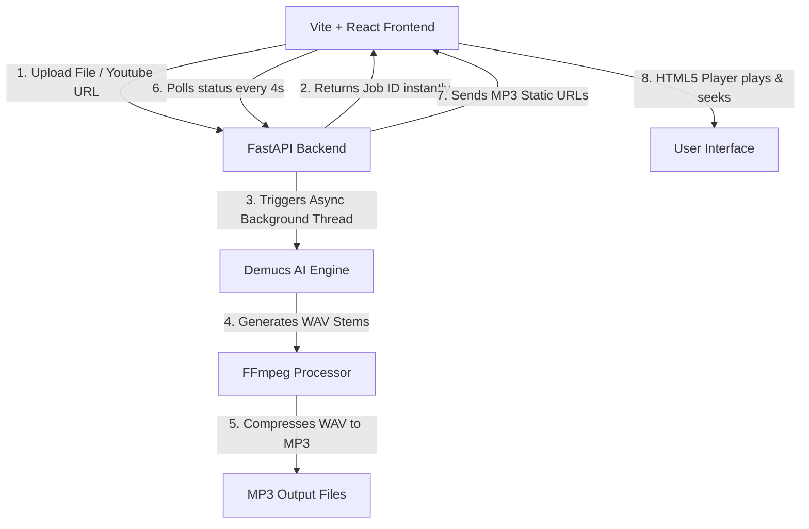

---
tags:
  - project/music-splitter
  - tech/fastapi
  - tech/react
  - tech/pytorch
  - deploy/huggingface
status: Active
created: 2026-07-06
version: 1.0.0
---

# 🎵 AI Music Splitter — Project Notebook

Welcome to the central Obsidian note for the **AI Music Splitter** project. This document serves as a comprehensive developer reference, mapping the system architecture, directory layouts, core API endpoints, optimizations, and deployment playbooks.

---

## 🏗️ 1. Architecture & Data Flow

The project is structured as a decoupled client-server application optimized to run on resource-constrained hosting (e.g., Hugging Face Spaces CPU Free Tier).



### Flow Breakdown:
1. **Initiation**: The frontend uploads a file or initiates a YouTube URL search.
2. **Immediate Return**: The backend logs a job, generates a unique `jobId`, starts a background processing thread, and returns the `jobId` immediately to prevent HTTP timeouts.
3. **Audio Separation**: Meta's `htdemucs` model processes the audio on a separate thread, separating it into `vocals` (vocal stem) and `no_vocals` (instrumental stem).
4. **Compression**: FFmpeg converts the raw WAV output (typically 80-100MB) to MP3 format (~5MB) at 192kbps.
5. **Polling**: The frontend polls the status of the job every 4 seconds. When complete, the backend responds with URLs to the static MP3 assets.

---

## 📂 2. Directory Structure

Below is the directory map of the cleaned-up codebase, listing the purpose of each active file:

```
c:/MusicSpliter/MusicSpliter/
├── .agents/                    # Custom AI agent guidelines & skills
├── audio-splice-studio/         # Vite + React Frontend
│   ├── src/
│   │   ├── components/
│   │   │   ├── ui/             # Retained active shadcn/ui components
│   │   │   │   ├── alert.tsx
│   │   │   │   ├── button.tsx
│   │   │   │   ├── card.tsx
│   │   │   │   ├── sonner.tsx
│   │   │   │   ├── toast.tsx
│   │   │   │   ├── toaster.tsx
│   │   │   │   └── tooltip.tsx
│   │   │   ├── AdSenseSlot.tsx       # Google AdSense integration slot
│   │   │   ├── AudioPlayer.tsx       # Custom visualizer and audio player
│   │   │   ├── ProcessingState.tsx   # Live logs & stopwatch indicator
│   │   │   └── YoutubeSearch.tsx     # YouTube search UI with debounced search
│   │   ├── hooks/
│   │   │   └── use-toast.ts          # Toast notification hook logic
│   │   ├── lib/
│   │   │   └── utils.ts              # Styling helpers (e.g. cn)
│   │   ├── pages/
│   │   │   ├── Index.tsx             # Main client page layout & state logic
│   │   │   └── NotFound.tsx          # 404 fallback page
│   │   ├── services/
│   │   │   └── api.ts                # Axios API services and job polling
│   │   ├── App.css
│   │   ├── App.tsx                   # Routes and global state wraps
│   │   ├── index.css                 # Custom global styling and animation definitions
│   │   └── main.tsx                  # Vite frontend mount point
│   ├── index.html                    # Frontend HTML shell
│   ├── package.json                  # Frontend dependencies
│   ├── tailwind.config.ts            # Tailwind CSS configuration
│   └── vite.config.ts                # Vite configurations & dev-proxy settings
├── backend/                    # FastAPI Backend
│   ├── main.py                       # Main backend logic (FastAPI, job loop, YouTube downloader)
│   ├── requirements.txt              # Python packages for backend
│   ├── test_tone.wav                 # 130-byte WAV file used to pre-cache Demucs model
│   └── fly.toml                      # Fly.io deployment configurations
├── Dockerfile                  # Production multi-stage Docker build config (Hugging Face / Fly)
├── README.md                   # Main project introduction
└── HOW_IT_WORKS.md             # In-depth architectural documentation
```

---

## 📡 3. API Reference

All backend endpoints are hosted on port `8000` (or `7860` in production Docker). The frontend communicates through Vite's dev proxy locally and same-origin in production.

### General Endpoints

#### 🟢 Get Health
*   **Endpoint**: `GET /health`
*   **Response**: `{"status": "ok"}`
*   **Purpose**: Used by Hugging Face Space or Docker systems as a startup/readiness probe.

#### ⚙️ Get Configuration
*   **Endpoint**: `GET /config`
*   **Response**: 
    ```json
    {
      "adsense_client_id": "ca-pub-xxx...",
      "adsense_slot_id": "12345..."
    }
    ```
*   **Purpose**: Provides runtime AdSense IDs loaded from the server's environment variables.

---

### Separation Pipeline

#### 📤 Submit Audio for Splitting (Upload)
*   **Endpoint**: `POST /split`
*   **Content-Type**: `multipart/form-data`
*   **Parameters**: `file` (UploadFile)
*   **Response (Immediate)**:
    ```json
    {
      "job_id": "8b23c21a-..."
    }
    ```

#### 🔍 Submit YouTube URL for Splitting
*   **Endpoint**: `POST /split-youtube`
*   **Content-Type**: `application/json`
*   **Body**:
    ```json
    {
      "url": "https://www.youtube.com/watch?v=..."
    }
    ```
*   **Response (Immediate)**:
    ```json
    {
      "job_id": "a90f112e-..."
    }
    ```

#### 📊 Poll Job Status
*   **Endpoint**: `GET /jobs/{job_id}`
*   **Response (Processing)**:
    ```json
    {
      "status": "processing",
      "progress": 35,
      "logs": ["Job initialized...", "Downloading YouTube audio...", "Starting Demucs separation..."]
    }
    ```
*   **Response (Completed)**:
    ```json
    {
      "status": "completed",
      "vocals": "/download/a90f112e-.../vocals",
      "karaoke": "/download/a90f112e-.../karaoke"
    }
    ```
*   **Response (Failed)**:
    ```json
    {
      "status": "failed",
      "error": "Reason for processing failure..."
    }
    ```

#### 📥 Download Stems
*   **Endpoint**: `GET /download/{job_id}/{file_type}`
*   **File Types**: `vocals` (vocals track), `karaoke` (instrumental track)
*   **Response**: Static file download (`.mp3` format).

---

## ⚡ 4. Hugging Face Spaces Optimizations

Hugging Face's free tier has strict environment limitations (2 vCPUs, no GPU, 60s gateway timeouts). The following measures ensure stable operation:

> [!info] **Async Job Polling**
> Instead of keeping `/split` open, the frontend receives a `jobId` instantly and polls `/jobs/{jobId}` every 4 seconds. This bypasses the Nginx 60-second gateway timeout.

> [!warning] **CPU Thrashing Prevention**
> PyTorch will normally spawn threads matching all CPU cores, creating heavy context switching in virtualized environments. 
> To prevent this, the backend limits thread counts dynamically:
> ```python
> os.environ["OMP_NUM_THREADS"] = "2"
> os.environ["MKL_NUM_THREADS"] = "2"
> ```
> Demucs CLI execution is also throttled using `-j 1` (single-thread mode).

> [!tip] **Pre-Cached AI Weights**
> During `docker build`, the container runs a dummy audio separation on `test_tone.wav`. This forces PyTorch to download and cache the `htdemucs` weights into the image layers, saving 40-50 seconds during runtime.

> [!important] **WAV to MP3 Transcoding**
> Raw WAV files are extremely large (80-100MB) and do not support seeking in HTML5 players. FFmpeg transcodes outputs to 192kbps MP3s (~5MB), enabling instant seeking and download speeds.

---

## 🛠️ 5. Developer Guide

### Running Locally
To launch the complete local stack for development:

1.  **FastAPI Backend**:
    ```bash
    cd backend
    # Activate virtual environment
    .venv/Scripts/activate # Windows
    pip install -r requirements.txt
    uvicorn main:app --reload --port 8000
    ```
2.  **Vite Frontend**:
    ```bash
    cd audio-splice-studio
    npm install
    npm run dev
    ```
    *Vite automatically forwards `/split`, `/jobs`, `/config`, and `/download` calls to `http://localhost:8000` via its development server proxy configuration.*

---

### Production Deployment (Hugging Face Spaces)

The Hugging Face Space remote matches the local `main` branch. To deploy local updates:

```bash
# 1. Stage and commit changes locally
git add .
git commit -m "feat: your change description"

# 2. Push to GitHub (Origin)
git push origin main

# 3. Push to Hugging Face Spaces (HF)
git push hf main
```

Upon pushing to the `hf` remote, Hugging Face will automatically rebuild the container image using the root [Dockerfile](file:///c:/MusicSpliter/MusicSpliter/Dockerfile) and redeploy the Space.
