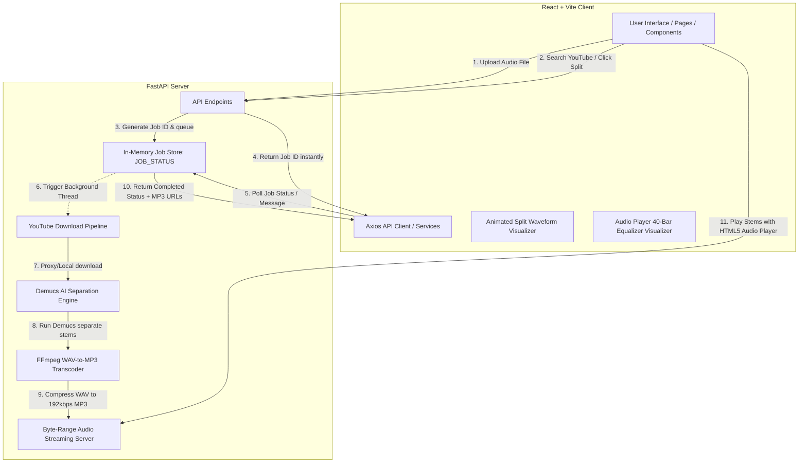

---
tags:
  - project/music-splitter
  - tech/fastapi
  - tech/react
  - tech/pytorch
  - tech/demucs
  - deploy/huggingface
status: Active
created: 2026-07-06
version: 1.1.0
---

# 🎵 AI Music Splitter — Project Notebook

Welcome to the central Obsidian note and developer reference for the **AI Music Splitter** project. This document provides a detailed layout of the system architecture, file purposes, API schemas, design implementation, key optimizations, and deployment procedures so that any developer or AI agent (like Claude) can gain a complete understanding of the system in one read.

---

## 🏗️ 1. Architecture & Data Flow

The project is structured as a decoupled client-server application optimized to run on resource-constrained hosting environments (such as the Hugging Face Spaces CPU Free Tier).



### End-to-End Processing Workflow:
1. **Initiation**: The user uploads a local audio file (up to 20MB) or searches for a song, finds it in the YouTube results, and clicks "Split Stems".
2. **Instant Job Queueing**: The FastAPI backend generates a unique hexadecimal UUID `jobId`, registers a new status entry in an in-memory dictionary `JOB_STATUS`, spawns an asynchronous background processing task (using `asyncio.create_task`), and immediately returns the `jobId` to the frontend with HTTP status 200/201. This prevents HTTP timeouts.
3. **Background Processing**:
   - **Download (YouTube only)**: Downloads audio using the Proxy-Download Pipeline (detailed below) directly into the workspace root.
   - **Resampling**: Uses FFmpeg to resample the audio to 44,100Hz stereo WAV format, saving disk space by removing the original raw files.
   - **Demucs Separation**: Meta's `htdemucs` model executes in single-thread mode (`-j 1`) to split the resampled WAV audio into two stems: `vocals.wav` and `no_vocals.wav`.
   - **Compression**: FFmpeg transcodes these raw WAV outputs to 192kbps MP3 format (`vocals.mp3` and `no_vocals.mp3`) to enable quick downloads and range seeking.
4. **Client Polling**: While the backend processes, the frontend displays a stopwatch-backed screen (`ProcessingState.tsx`) showing custom animation waves and rotating music trivia. The client polls the `/jobs/{jobId}` endpoint every 4 seconds.
5. **Completion & Streaming**: When complete, the backend responds with absolute-like paths to the MP3 outputs. The frontend renders two instances of `AudioPlayer.tsx` which stream the audio files from `/files/{model}/{jobId}/{filename}` utilizing HTTP 206 Partial Content range responses, allowing standard seeking on HTML5 players.

---

## 📂 2. Directory Structure

Below is the directory map of the codebase, detailing the purpose of every file:

```
c:/MusicSpliter/MusicSpliter/
├── .agents/                        # Custom AI agent guidelines & skills
├── audio-splice-studio/             # React + TypeScript + Vite Frontend
│   ├── src/
│   │   ├── components/
│   │   │   ├── ui/                 # Retained active shadcn/ui components (Styled via Tailwind)
│   │   │   │   ├── alert.tsx       # Standard UI alerts
│   │   │   │   ├── button.tsx      # Standard buttons and custom neon states
│   │   │   │   ├── card.tsx        # Standard containers
│   │   │   │   ├── sonner.tsx      # Toaster alert service
│   │   │   │   ├── toast.tsx       # Individual toast rendering
│   │   │   │   ├── toaster.tsx     # Toast container
│   │   │   │   └── tooltip.tsx     # Micro-tooltips
│   │   │   ├── AdSenseSlot.tsx     # Google AdSense integration slot with config fetch & fallbacks
│   │   │   ├── AudioPlayer.tsx     # Custom visualizer audio player (40 equalizers, range seeking)
│   │   │   ├── ProcessingState.tsx # Stopwatch, canvas background waves, rotating facts
│   │   │   └── YoutubeSearch.tsx   # YouTube search bar (debounced input, video details)
│   │   ├── hooks/
│   │   │   └── use-toast.ts        # UI toast utility hook
│   │   ├── lib/
│   │   │   └── utils.ts            # Styling helper (combines clsx and tailwind-merge)
│   │   ├── pages/
│   │   │   ├── Index.tsx           # Primary app layout, tab switching, and state machine
│   │   │   ├── NotFound.tsx        # Fallback 404 page
│   │   │   ├── PrivacyPolicy.tsx   # Privacy Policy page layout (AdSense & Cookies notice)
│   │   │   └── AboutContact.tsx    # Technical information and support contact page
│   │   ├── services/
│   │   │   └── api.ts              # Axios instance, endpoints caller, and poll loop
│   │   ├── App.css                 # Route-specific layout stylesheets
│   │   ├── App.tsx                 # Core App component with router providers
│   │   ├── index.css               # Design system rules, variables, keyframe animations
│   │   └── main.tsx                # Frontend entry mounting React
│   ├── index.html                  # Main HTML shell containing Google Font imports (Outfit, Poppins)
│   ├── package.json                # Frontend dependencies (Axios, Lucide-react, Tailwind, Radix)
│   ├── tailwind.config.ts          # Tailwind configuration detailing theme colors, custom animations
│   └── vite.config.ts              # Vite configurations and local development reverse proxy
├── backend/                        # FastAPI Backend
│   ├── main.py                     # Main server logic, download pipeline, Demucs thread logic, APIs
│   ├── requirements.txt            # Python dependencies (FastAPI, PyTorch, Demucs, Uvicorn, yt-dlp)
│   ├── test_tone.wav               # 130-byte WAV file used to pre-cache the Demucs weights at build
│   └── fly.toml                    # Fly.io production configuration
├── Dockerfile                      # Multi-stage production container build file (frontend + backend)
├── README.md                       # High-level overview of the project
├── HOW_IT_WORKS.md                 # Deeper structural/deployment manual
└── PROGRESS.md                     # Development progress tracker
```

---

## 📡 3. API Reference

The backend runs on port `8000` locally and `7860` in production. The client communicates through Vite's dev-proxy locally and uses same-origin mapping in production.

### General Endpoints

#### 🟢 Get Health
*   **Endpoint**: `GET /health`
*   **Response**: 
    ```json
    {
      "status": "ok",
      "activeJobs": 0
    }
    ```
*   **Purpose**: Startup/readiness probe used by Docker and Hugging Face. Returns count of currently active background processing tasks.

#### ⚙️ Get Configuration
*   **Endpoint**: `GET /config`
*   **Response**: 
    ```json
    {
      "adsenseClientId": "ca-pub-xxxxxxxxxxxx",
      "adsenseSlotId": "xxxxxxxxxx"
    }
    ```
*   **Purpose**: Dynamically pulls Google AdSense configuration IDs from backend environment variables so the frontend does not have hardcoded IDs.

---

### Separation Endpoints

#### 📤 Submit Local Audio File (Upload)
*   **Endpoint**: `POST /split`
*   **Content-Type**: `multipart/form-data`
*   **Request Params**: `file` (Binary file stream)
*   **Supported Formats**: `.mp3`, `.wav`, `.m4a`, `.flac`, `.aac`, `.ogg`, `.webm`, `.wma` (Checked via extension)
*   **Size Limit**: Enforced max of 20MB.
*   **Response (Immediate)**:
    ```json
    {
      "jobId": "2abd240d873f4c78853e4735daba3f7b",
      "status": "queued"
    }
    ```

#### 🔍 Search YouTube Videos
*   **Endpoint**: `GET /youtube/search`
*   **Parameters**:
    *   `q` (Query string, required)
    *   `maxResults` (Integer, default `8`)
*   **Purpose**: Interfaces with the YouTube Data API v3 (restricted to music category `10`) to query matching videos. It performs a secondary bulk API call to get video content details to parse durations.
*   **Response**:
    ```json
    {
      "results": [
        {
          "videoId": "dQw4w9WgXcQ",
          "title": "Rick Astley - Never Gonna Give You Up",
          "channelTitle": "Rick Astley",
          "thumbnail": "https://i.ytimg.com/vi/dQw4w9WgXcQ/mqdefault.jpg",
          "durationSec": 212,
          "url": "https://www.youtube.com/watch?v=dQw4w9WgXcQ"
        }
      ]
    }
    ```

#### 📥 Submit YouTube URL for Splitting
*   **Endpoint**: `POST /youtube/split`
*   **Content-Type**: `application/json`
*   **Body**:
    ```json
    {
      "url": "https://www.youtube.com/watch?v=dQw4w9WgXcQ",
      "title": "Never Gonna Give You Up"
    }
    ```
*   **Response (Immediate)**:
    ```json
    {
      "jobId": "7df3e2b9c7b94a828e83f81e3a9c7b9d",
      "status": "queued"
    }
    ```

#### 📊 Poll Job Status
*   **Endpoint**: `GET /jobs/{job_id}`
*   **Response (Queued/Processing)**:
    ```json
    {
      "jobId": "7df3e2b9c7b94a828e83f81e3a9c7b9d",
      "status": "processing",
      "message": "Running AI separation using htdemucs (takes ~1.5 min)...",
      "createdAt": 1783348154.2
    }
    ```
*   **Response (Completed)**:
    ```json
    {
      "jobId": "7df3e2b9c7b94a828e83f81e3a9c7b9d",
      "status": "completed",
      "message": "Done!",
      "vocals": "/files/htdemucs/7df3e2b9c7b94a828e83f81e3a9c7b9d/vocals.mp3",
      "karaoke": "/files/htdemucs/7df3e2b9c7b94a828e83f81e3a9c7b9d/no_vocals.mp3",
      "createdAt": 1783348154.2,
      "finishedAt": 1783348248.8
    }
    ```
*   **Response (Failed)**:
    ```json
    {
      "jobId": "7df3e2b9c7b94a828e83f81e3a9c7b9d",
      "status": "failed",
      "message": "We encountered an error while separating the vocals...",
      "createdAt": 1783348154.2,
      "finishedAt": 1783348210.1
    }
    ```

#### 🔊 Stream Audio Files
*   **Endpoint**: `GET /files/{model_name}/{job_id}/{filename}`
*   **Parameters**:
    *   `model_name`: e.g. `htdemucs`
    *   `job_id`: Hexadecimal job UUID
    *   `filename`: `vocals.mp3` or `no_vocals.mp3`
*   **HTTP Protocol**: Support for `Range` header (HTTP 206 Partial Content / Bytes). Returns standard `StreamingResponse` with `Content-Range`, `Accept-Ranges`, and `Content-Length`.
*   **Purpose**: Directly hooks up to standard HTML5 `<audio>` tag elements to allow instant play, seek (scrubbing), and download operations without downloading the entire file beforehand.

#### 🧹 Trigger File Cleanup
*   **Endpoint**: `POST /cleanup`
*   **Response**: `{"message": "Cleanup completed"}`
*   **Purpose**: Manually drops all cached folders inside `demucs_output` and resets `JOB_STATUS`. (A callback is also registered via Python's `atexit.register` to clean files when the server processes shut down).

---

## 🔗 4. YouTube Proxy-Download Pipeline

Because direct calls to YouTube from cloud providers (like Hugging Face or Fly.io) are heavily throttled or completely blocked, the backend implements a highly resilient download pipeline containing three tiers:

```
[Start YouTube Job]
       │
       ▼
┌──────────────────────────────┐
│  Tier 1: Cobalt API Proxy    │──(Success)──► [Store MP3 & Start Demucs]
└──────────────────────────────┘
       │
    (Fail)
       ▼
┌──────────────────────────────┐
│ Tier 2: Invidious API Proxy  │──(Success)──► [Store MP3 & Start Demucs]
└──────────────────────────────┘
       │
    (Fail)
       ▼
┌──────────────────────────────┐
│     Tier 3: yt-dlp Local     │──(Success)──► [Store MP3 & Start Demucs]
└──────────────────────────────┘
       │
    (Fail)
       ▼
[Set Job Status = Failed]
```

1.  **Tier 1: Cobalt API Proxy**
    *   Fetches working Cobalt instances dynamically from `https://cobalt.directory/api/working?type=api`.
    *   Iterates through instances, posting the payload `{"url": url, "downloadMode": "audio"}`.
    *   Streams the returned Cobalt audio stream url directly to the filesystem.
2.  **Tier 2: Invidious API Proxy**
    *   Extracts the 11-character YouTube video ID.
    *   Fetches active Invidious instances from `https://api.invidious.io/instances.json` and filters by monitor uptime (highest uptime first).
    *   Queries `instance/api/v1/videos/{video_id}` and grabs adaptive audio-only streams, proxying the download through `?local=true`.
3.  **Tier 3: Local yt-dlp Executable**
    *   If all proxies fail, the backend executes `yt-dlp` locally as a subprocess:
        `yt-dlp --no-playlist -x --audio-format mp3 --audio-quality 0 -o {path} {url}`

---

## ⚡ 5. Hugging Face Spaces Optimizations

Hugging Face CPU spaces run on 2 vCPUs and have strict resource boundaries. The following optimizations make it possible to run Demucs weights inside these limits:

*   **Preventing CPU Thrashing**:
    *   By default, PyTorch attempts to leverage all CPU cores, creating heavy context-switching delays on virtualized architectures. The backend enforces:
        ```python
        os.environ["OMP_NUM_THREADS"] = "2"
        os.environ["MKL_NUM_THREADS"] = "2"
        os.environ["OPENBLAS_NUM_THREADS"] = "2"
        os.environ["NUMEXPR_NUM_THREADS"] = "2"
        os.environ["VECLIB_MAXIMUM_THREADS"] = "2"
        ```
    *   Demucs separation command is executed with `-j 1` (single CPU thread processing).
*   **Weights Pre-Caching**:
    *   Downloading Demucs weights at runtime takes 40-50 seconds.
    *   The `Dockerfile` performs a "dummy" separation on a 130-byte silent audio file ([test_tone.wav](file:///c:/MusicSpliter/MusicSpliter/backend/test_tone.wav)) during the container build stage. This forces PyTorch to cache the model weights inside the Docker image layers, meaning zero weight-download overhead during runtime.
*   **Memory Efficiency**:
    *   The backend saves uploaded files, resamples them to WAV, separates them, converts them to MP3, and immediately deletes the original files to minimize disk usage.
    *   The output WAV files generated by Demucs are immediately unlinked after MP3 compression.

---

## 🎨 6. Rich User Interface & Custom Components

The client features custom animations, high-fidelity widgets, and canvas rendering:

*   **Split Waveform Visualizer (`Index.tsx`)**:
    *   Uses an HTML5 `<canvas>` rendering loop (`requestAnimationFrame`) to show two synchronized, breathing waveforms (Music in purple/indigo gradients and Vocals in mint/emerald gradients). It includes audio speaker symbols with radiating sound waves.
*   **Equalizer Audio Player (`AudioPlayer.tsx`)**:
    *   Instead of standard sliders, seeking is handled on a 40-bar EQ visualization bar. The bars are shaped dynamically (higher in the center, lower on the sides) and scale dynamically when playing.
    *   Clicking on any equalizer bar recalculates the horizontal offset percentage and triggers `audioRef.current.currentTime = newTime`, updating the player instantly.
*   **Processing Watch (`ProcessingState.tsx`)**:
    *   Draws an fullscreen overlay. It shows a large digital stopwatch, a glowing pulse animation container, a progressive loading bar, and three smooth independent canvas waves moving at variable speeds.

---

## 🛠️ 7. Developer Guide

### Running Locally

1.  **FastAPI Backend**:
    Ensure FFmpeg is installed and added to the PATH.
    ```bash
    cd backend
    # Activate virtualenv
    .venv/Scripts/activate # Windows PowerShell
    # Install dependencies
    pip install -r requirements.txt
    # Start uvicorn
    uvicorn main:app --reload --port 8000
    ```
2.  **Vite Frontend**:
    ```bash
    cd audio-splice-studio
    npm install
    npm run dev
    ```
    *Vite automatically forwards the endpoints (`/split`, `/youtube`, `/jobs`, `/config`, and `/files`) to `http://localhost:8000` via its development proxy settings in `vite.config.ts`.*

---

### Production Deployment (Hugging Face Spaces)

To deploy updates to Hugging Face Spaces:

1.  Create a Space on Hugging Face using the **Docker** SDK (not Streamlit/Gradio).
2.  Add the space repository remote URL to your local Git configuration:
    ```bash
    git remote add hf https://huggingface.co/spaces/<your-username>/<space-name>
    ```
3.  Deploy updates:
    ```bash
    git add .
    git commit -m "feat: updated separation optimizations"
    git push origin main
    git push hf main
    ```
4.  Optionally add environment variables in your Hugging Face Space Settings:
    *   `ADSENSE_CLIENT_ID` (e.g. `ca-pub-xxxxxxxxxxxx`)
    *   `ADSENSE_SLOT_ID` (e.g. `xxxxxxxxxx`)
